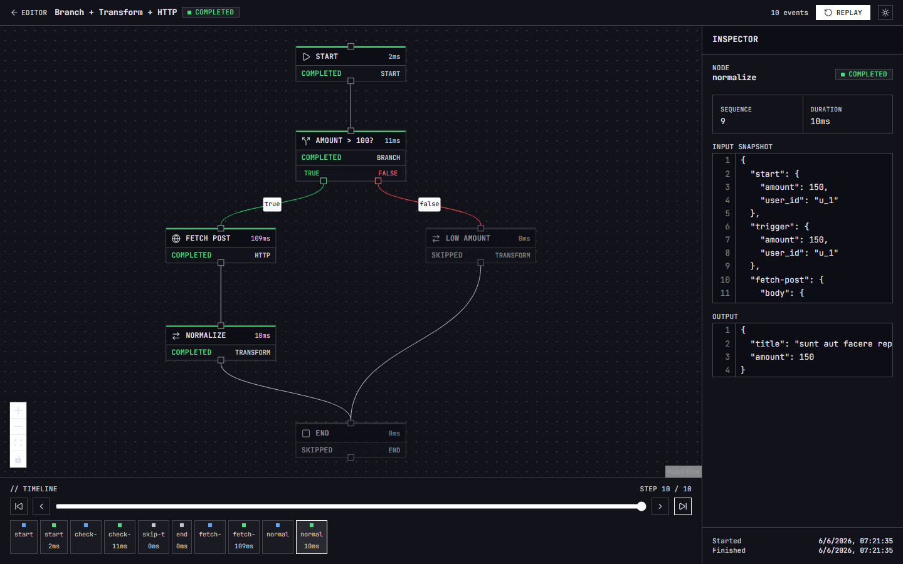
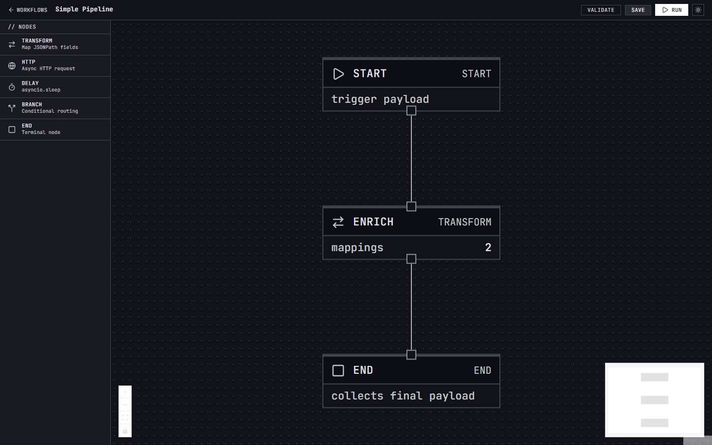
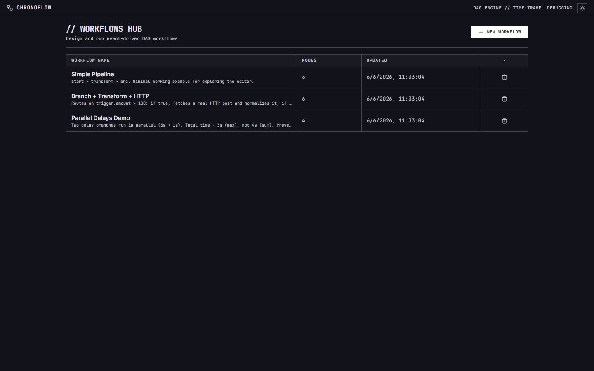
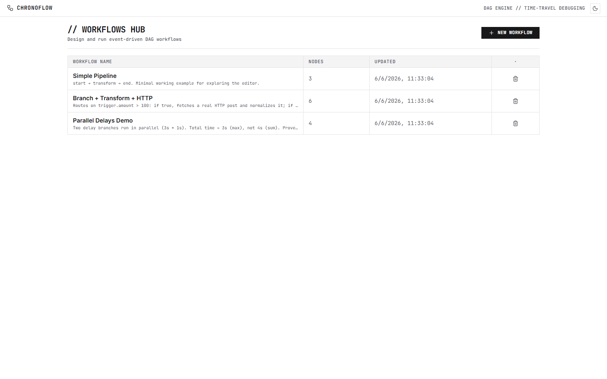

# ChronoFlow

> **Motor de workflows event-driven** basado en grafos acíclicos dirigidos (DAG), con
> **ejecución paralela asíncrona**, **expresiones JSONPath** para payloads dinámicos y
> **Time-Travel Debugging**: recorré, auditá y reproducí el estado histórico de cualquier
> ejecución, nodo por nodo.

  ·  
<!-- Cuando haya deploy: reemplazar por [](URL_REAL) -->

Stack: **React Flow · FastAPI · PostgreSQL · asyncio**

### UI — "Conductor OS" (tema claro / oscuro)

| Time-Travel Debugger | Editor de DAG |
|---|---|
|  |  |

| Workflows Hub (oscuro) | Workflows Hub (claro) |
|---|---|
|  |  |

---

## ¿Qué resuelve?

Las herramientas de automatización (Zapier, n8n, Airflow) ejecutan grafos de tareas, pero
depurar *por qué* una corrida produjo cierto resultado suele ser opaco. **ChronoFlow** trata
cada ejecución como una secuencia de **snapshots inmutables**: podés rebobinar la corrida y ver,
en cada instante, qué nodos corrieron, en qué orden (incluido el **paralelismo**) y con qué
payload de entrada/salida. Es un "debugger con viaje en el tiempo" para workflows.

### Features
- **Editor visual de DAG** (React Flow): arrastrá nodos, conectá edges, configurá cada paso.
- **Ejecución paralela asíncrona**: scheduler por *ready-set* — ramas independientes corren a la vez (dos `delay(3s)` y `delay(1s)` en paralelo ⇒ ~3s, no 4s).
- **Nodos**: `start · transform · http · delay · branch · end`.
- **Expresiones JSONPath** para mapear payloads entre nodos + plantillas en URLs/bodies.
- **Branches condicionales** con evaluador propio y **seguro** (sin `eval`).
- **Time-Travel Debugging**: timeline scrubber paso a paso sobre `ExecutionEvent` append-only.
- **Replay**: reproducí una corrida idéntica desde su payload de disparo.
- **Live**: seguimiento en vivo de la corrida por WebSocket.
- **UI "Conductor OS"**: estética Swiss Minimalist / consola industrial, con **tema claro/oscuro** (toggle persistido, respeta `prefers-color-scheme`) e íconos SVG (`lucide-react`).

---

## Arquitectura (resumen)

Monorepo de 3 componentes. El detalle —modelo de dominio, contrato de API, algoritmo del
scheduler y decisiones técnicas— está en **[`ARCHITECTURE.md`](./ARCHITECTURE.md)**.

```
chronoflow/
├── apps/
│   ├── web/   # React + Vite + TS + React Flow   (UI: editor + debugger)
│   └── api/   # FastAPI + SQLAlchemy 2.x async    (engine + REST + WS)
├── docker-compose.yml   # db + api + web
├── ARCHITECTURE.md      # contrato central
└── docs/                # capturas, diagramas
```

---

## Cómo correr

### Opción A — Docker (todo junto, recomendado)
```bash
cp .env.example .env
docker compose up --build
# web  → http://localhost:8080
# api  → http://localhost:8000/docs  (Swagger)
# db   → localhost:5432
```

### Opción B — Local (dev)
```bash
# Backend
cd apps/api
python -m venv .venv && .venv\Scripts\activate   # Unix: source .venv/bin/activate
pip install -r requirements.txt
alembic upgrade head
uvicorn app.main:app --reload      # http://localhost:8000/docs

# Frontend (otra terminal)
cd apps/web
npm install
npm run dev                        # http://localhost:5173
```

---

## Probalo en 2 minutos

Al levantar, el backend **siembra 3 workflows de ejemplo** automáticamente. No hace falta crear nada
para ver las features clave. Entrá a la web (`:8080` con Docker, `:5173` en dev) y:

**1. Paralelismo real** — abrí **"Parallel Delays Demo"** → **Run** con payload `{}`.
Dos `delay` (3s y 1s) corren a la vez: la corrida termina en **~3s, no 4s**. En `/runs/:id` movés
el **scrubber** y ves ambos nodos arrancar en el mismo instante.

**2. Branch + JSONPath + HTTP** — abrí **"Branch + Transform + HTTP"** (condición `$.trigger.amount > 100`):
| Payload de disparo | Qué pasa |
|---|---|
| `{"amount": 150}` | rama **true** → fetch HTTP real + normaliza con JSONPath |
| `{"amount": 50, "note": "low"}` | rama **false** → pasa derecho (ves la **poda** de la rama no tomada) |

**3. Time-Travel** — abrí **"Simple Pipeline"** → **Run** con `{"user_id": 1, "action": "login"}`.
En `/runs/:id` recorré los **snapshots inmutables** por nodo (input/output en cada paso) y probá **Replay**.

**4. Editor desde cero** — desde el hub creás un workflow y armás el grafo con la paleta de la izquierda:
`start → … → end`. Recordá la regla del validador: **exactamente un `start`** y al menos un `end`.

> Guía de pruebas exhaustiva (rutas de smoke-test, errores esperados, WS en vivo): **[`docs/QA-CHECKLIST.md`](./docs/QA-CHECKLIST.md)**.

---

## Tests
```bash
cd apps/api && pytest        # engine (paralelismo, ciclos, JSONPath, time-travel) + endpoints
cd apps/web && npm run test  # Vitest (componentes + hooks)
```

---

## Limitaciones conocidas
- El task manager es **in-process** (`asyncio.create_task`): ideal para la demo, no sobrevive
  reinicios ni escala multi-worker. En producción se reemplaza por una cola durable (Arq/Celery + Redis).
- El nodo `http` es **no-determinista** en *replay* (depende de un servicio externo).

---

## Licencia

© 2026 Mateo Pavoni. Todos los derechos reservados. Software propietario, publicado solo con
fines de evaluación/portfolio. Prohibida su copia, redistribución o reuso sin autorización
escrita. Ver [LICENSE](./LICENSE).


